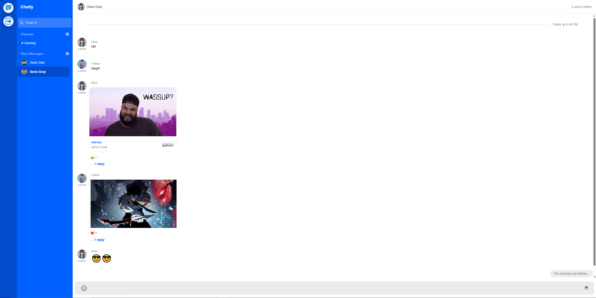
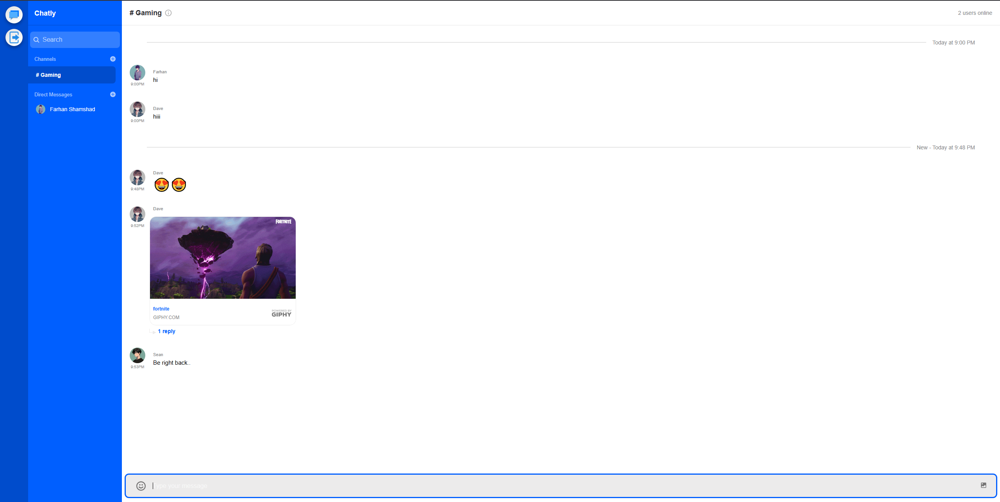
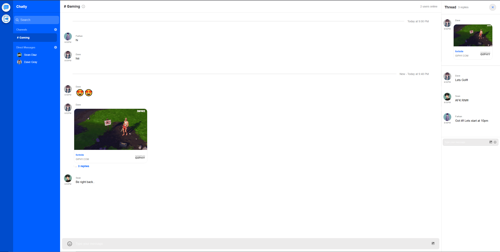

# 💬 Chatify – A Real-Time Chat Application

**Chatify** is a full-stack real-time messaging web app that enables users to communicate one-on-one or in groups. Users can sign up, create or join channels, send text messages, media files, emojis, GIFs, and YouTube links, and even reply to specific messages in threads. It’s optimized for modern devices and provides a dynamic, interactive chat experience using Stream Chat API.



---

## 🚀 Features

- 🔐 User authentication: Sign up and log in securely  
- 💬 Real-time messaging via channels or direct messages  
- 🧑‍🤝‍🧑 Group chat (channels) and direct user-to-user messaging  
- 👥 See how many users are currently online in a group or DM  
- ✏️ Edit channel name and manage participants  
- 🔍 Search functionality for finding channels and users  
- 🖼️ Media support: Send images and YouTube links (previewable in-chat)  
- 😄 Emoji and GIF support via `/giphy [text]`  
- ❤️ React to messages with emojis  
- ✏️ Edit/delete messages  
- 🧵 Threaded replies to individual messages  
- 📱 Responsive UI across all devices

---

## 🧰 Tech Stack

### 🖥️ Frontend (React)

| Library / Tool          | Purpose                          |
|-------------------------|----------------------------------|
| `react`, `react-dom`    | Frontend rendering               |
| `stream-chat`           | Core chat functionality (Stream) |
| `stream-chat-react`     | UI components for Stream Chat    |
| `axios`                 | HTTP requests                    |
| `universal-cookie`      | Cookie storage for auth          |

### 🌐 Backend (Node.js + Express)

| Library / Tool            | Purpose                        |
|---------------------------|--------------------------------|
| `express`                 | Server framework               |
| `getstream`, `stream-chat`|    | JWT authentication        |
| `bcryptjs`                | Password hashing               |
| `cors`                    | Enable cross-origin requests   |
| `dotenv`                  | Manage environment variables   |
| `nodemon`                 | Dev mode auto-restart          |

---

## 🗂️ Project Folder Structure

```
chatlify/
├── client/                           # React frontend
│   ├── public/                       # Static public assets (index.html, etc.)
│   ├── src/
│   │   ├── assets/                   # Images, icons, logos, etc.
│   │   ├── components/              # All UI and logic components
│   │   │   ├── Auth.jsx
│   │   │   ├── ChannelContainer.jsx
│   │   │   ├── ChannelInner.jsx
│   │   │   ├── ChannelListContainer.jsx
│   │   │   ├── ChannelSearch.jsx
│   │   │   ├── CreateChannel.jsx
│   │   │   ├── EditChannel.jsx
│   │   │   ├── ResultsDropdown.jsx
│   │   │   ├── TeamChannelList.jsx
│   │   │   ├── TeamChannelPreview.jsx
│   │   │   ├── TeamMessage.jsx
│   │   │   ├── UserList.jsx
│   │   │   └── index.js
│   │   ├── App.jsx                  # Main app wrapper
│   │   └── index.js                 # React root render
│
├── server/                          # Node.js backend
│   ├── controllers/                 # Route controller logic
│   ├── routes/                      # API routes
│   ├── index.js                     # Entry point
│   └── .env                         # Environment variables
│
├── package.json                     # Project metadata and scripts
└── README.md                        # Project documentation
```

---

## 🧑‍💻 Setup & Installation

### 1️⃣ Clone the Repository

```bash
git clone https://github.com/Farhan3112/Chatly-Chat-App.git
cd Chatly-Chat-App
```

---

### 2️⃣ Backend Setup (`server`)

```bash
cd server
npm install
```

#### Create `.env` File:

```env
STREAM_APP_ID = app_id_stream
STREAM_API_KEY = api_key_stream
STREAM_API_SECRET = secret_api_key_stream
```

Start the backend:

```bash
npm start
```

App will run at: `http://localhost:5000`

---

### 3️⃣ Frontend Setup (`client`)

```bash
cd client
npm install
```

#### Create `.env` File:

```env
REACT_APP_STREAM_API_KEY = api_key_stream
REACT_APP_API_URL = http://localhost:5000/auth
```

App will run at: `http://localhost:3000`

---

## 🌐 Live Demo

🔗 [Live App on Render](https://chatly-client-18es.onrender.com)

---

## 🖼️ Screenshots

### 🏠 Direct Chat


---

### 📝 Group Chat


---

### 👤 Threads


---

## 📜 License

This project is licensed under the MIT License.

---

## 👨‍💻 Author

**Farhan Shamshad**  
[GitHub](https://github.com/Farhan3112)
